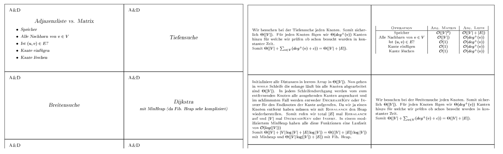

In a lot of old exams the professors asks for the runtime of some common graph algorithm. These questions are very easy if one knows the exact runtime. However, I have often found myself wondering if Dijkstra runs in `O(|E| + |V|log(|V|))` or if it runs in `O((|E| + |V|)log(|V|))`. The solutions is that if one uses a binary heap with `decreaseKey()` support it is the latter, whereas using a fibonacci heap gives us the first runtime.

As a result, this repo provides you with a PDF composed of flashcards (which I will print and laminate once the PDF is finished). 

Your contributions are very welcome. Feel free to add information to these flashcards. The more stuff we add, the better the flashcards are.

## Screenshot
Since this will probably change I haven't included a precompiled PDF but opted for a screenshot so you get an idea how these flashcards look like.

The following is a terrible and not to scale screenshot. On the left side is part of the front of the paper, on the right side is a part of the back of the paper.

Template configuration file from [https://github.com/figgis/japanese-flashcards/blob/master/avery5371.cfg](https://github.com/figgis/japanese-flashcards/blob/master/avery5371.cfg)