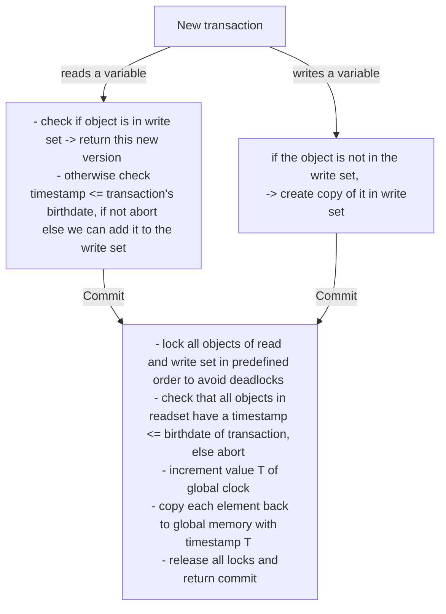
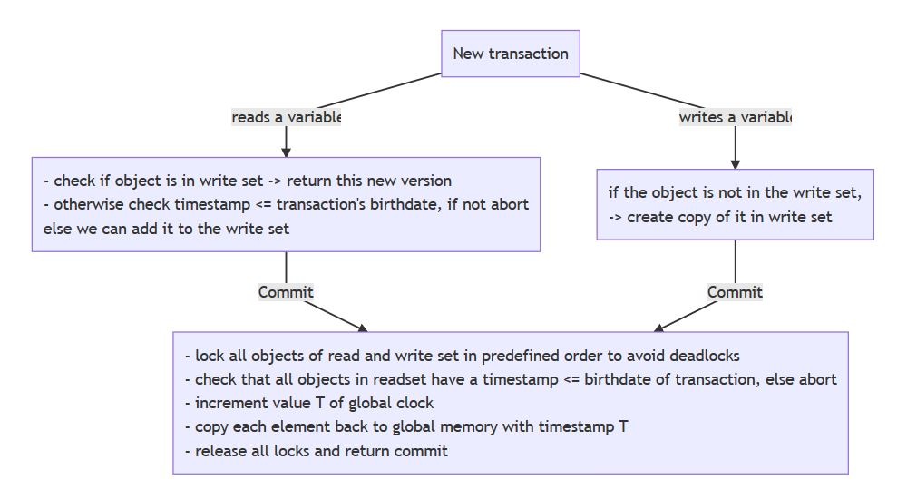

# Transactional Memory

## Motivation

Locks produce deadlocks and CAS can only operate one one value. We would like to atomically update multiple values at once. The bank account problem is a good example where we would like to atomically update multiple values at once.

- locks are pessimistic
- performance overhead paid every time
- if we change the synchronization scheme we must rewrite the entire program

## Basics of transactional memory

The programmer should be concerned about what should happen and not how. (i.e. locking should be done by the system).

This gives us the benefits:

- less error prone and simpler code
- higher level semantics
- optimistic by design -> does not require mutual exclusion

The changes made by the transaction are made visible atomically and all other thread see either the initial or the final state but no intermediate states.

-> Transactions appear serialized.

**Heavily inspired by databases**: ACID properties:

- **A**: Atomicity
- **C**: Consistency -> database remains in consistent state
- **I**: Isolation -> no mutual corruption of data
- **D**: Durability (not that important) -> data will survive power loss

## How does it work (on a high level)

1. We start transactions but only commit them if the variables they used haven't changed. -> abort if changed

## Implement Transactional Memory

### Hardware:

- can be fast
- only for small transactions
- was implemented on Intel Haswell but disabled by a software update since it was deemed to be unsafe.

### Software:

- greater flexibility
- may be slow

One can expect that there will be hybrid solutions in the future.

## Design Choices:

### Nesting:

Usually one has either *flat nesting*, meaning that as soon as a nested transaction fails the enclosing transaction also fails as well as *closed nesting* where there are multiple levels of transactions which can all abort by themselves but the final result is only written after the outermost transaction succeeded.

### Isolation:

- **weak isolation**: the shared state accessed by a transaction is also accessed outside of a transaction.
- **strong isolation**: the shared state accessed by a transaction cannot be accessed outside of a transaction. -> ScalaSTM uses this

## How does retry work?

The transaction aborts when retry() is called and will only be retried if a variable has changed.

## Clock based implementation:

